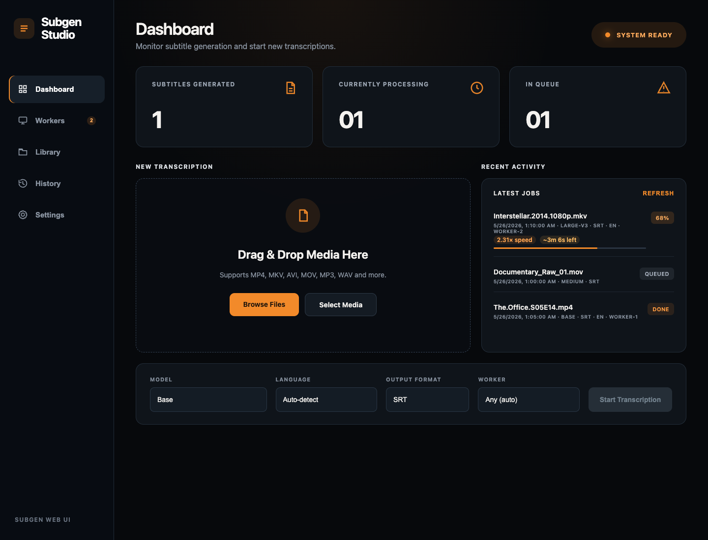
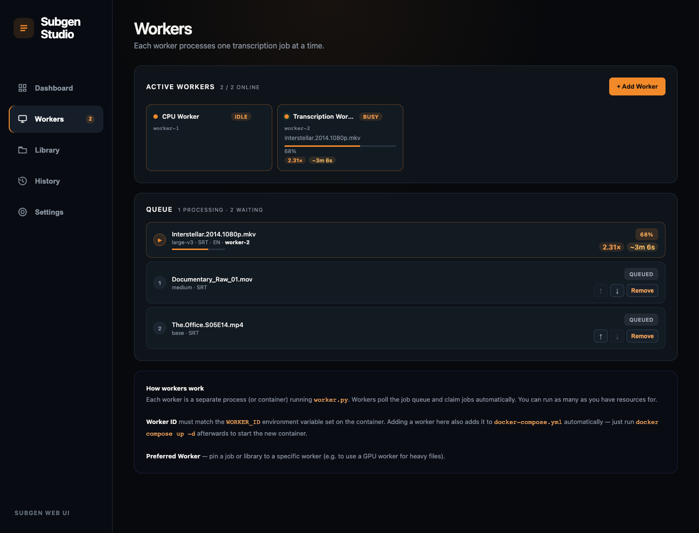

# Subgen Web UI

A self-hosted web interface for generating subtitles using [faster-whisper](https://github.com/SYSTRAN/faster-whisper). Upload media or watch a library folder, monitor workers in real time, and send completion events to Jellyfin or another webhook endpoint.

## Screenshots

### Dashboard



### Workers and Queue



## Features

- **Black and orange Studio dashboard** — operational overview, upload panel, recent activity, and worker-aware status
- **Drag-and-drop upload** — MP4, MKV, AVI, MOV, MP3, WAV, FLAC, and more
- **Live progress tracking** — real-time speed (×), ETA, and progress bar per job
- **Multiple workers** — run as many transcription workers as you have resources for, each processes one job at a time
- **Workers and queue view** — see worker status (idle/busy/offline), live queue position, speed, and ETA
- **Queue controls** — move waiting jobs up or down, or dismiss library items without re-queuing them on the next scan
- **Worker queue filtering** — inspect and reorder waiting jobs for one worker at a time
- **Controlled library scanning** — scan manually or set a daily sync time; adding a library does not immediately queue files
- **Generated subtitle logs** — view and download finished subtitles, or clear the log list without deleting saved outputs
- **English translation mode** — choose normal transcription or translate non-English audio into English subtitles
- **Jellyfin sidecars** — watched-library outputs are written beside media as language-tagged files such as `Episode.tr.srt` or `Episode.en.srt`
- **Clean watched folders** — ignores downloader fragment files and clears waiting items when a library is removed
- **Docker Compose sync** — adding or removing a worker in the UI automatically updates `docker-compose.yml`
- **Preferred worker** — pin a job or library to a specific worker (e.g. a GPU machine)
- **Webhook integrations** — trigger a Jellyfin library refresh or send a generic JSON webhook after completion
- **Robust busy status** — workers remain visible as busy while the Whisper model is loading
- **Output formats** — SRT, WebVTT, plain text
- **Models** — tiny · base · small · medium · large-v2 · large-v3

---

## Quick Start

### Docker Compose (recommended)

```bash
git clone https://github.com/S1mple32/subgen-webui.git
cd subgen-webui
docker compose up -d --build
```

Then open **http://localhost:8000**.

The default `docker-compose.yml` starts one web server and two workers. To add more workers, use the **Workers** tab in the UI — the compose file is updated automatically.

### Adding More Workers

From the **Workers** screen, click **+ Add Worker** and give the new worker an ID such as `worker-4`. Subgen adds a matching Compose service automatically. If you prefer to add one manually, copy an existing worker service and set a unique `WORKER_ID`:

```yaml
  worker-4:
    build: .
    cpuset: "0-5"  # Optional: share all six CPU cores with existing workers
    command: python worker.py
    environment:
      - WORKER_ID=worker-4
      - HOSTNAME=worker-4
      - PYTHONUNBUFFERED=1
      - DB_PATH=/data/jobs.db
    volumes:
      - uploads:/app/uploads
      - outputs:/app/outputs
      - models:/app/models
      - db:/data
      - /path/to/media:/media
    restart: unless-stopped
```

Start just the new worker and confirm that it connects:

```bash
docker compose up -d --build worker-4
docker compose ps
docker compose logs --tail 30 worker-4
```

Every worker processes one job at a time. On CPU-only systems, extra workers share available cores and can reduce per-job speed when several jobs run at once. The `cpuset` line is optional; omit it to let Docker schedule the worker across available CPUs.

### Mount your media folders

Edit `docker-compose.yml` and add volume mounts for your media directories:

```yaml
services:
  web:
    volumes:
      - /path/to/movies:/media/movies
      - /path/to/shows:/media/shows
  worker-1:
    volumes:
      - /path/to/movies:/media/movies
      - /path/to/shows:/media/shows

Library mounts must be writable if you want Jellyfin-compatible subtitle sidecars
saved beside the video files. Uploaded files still write their subtitle output to
the configured output directory.
```

Then add them as Libraries in the UI.

---

## Running Locally (without Docker)

**Requirements:** Python 3.9+, `ffmpeg` installed and on your PATH.

```bash
git clone https://github.com/S1mple32/subgen-webui.git
cd subgen-webui

pip install -r requirements.txt

# Terminal 1 — web server
uvicorn app:app --host 0.0.0.0 --port 8000

# Terminal 2 — worker (add more terminals for more workers)
WORKER_ID=worker-1 python worker.py
```

---

## Configuration

All settings are environment variables:

| Variable | Default | Description |
|---|---|---|
| `WORKER_ID` | random 8-char ID | Unique ID for this worker |
| `HOSTNAME` | system hostname | Display name in the UI |
| `DB_PATH` | `jobs.db` | Path to the SQLite database |
| `UPLOAD_DIR` | `uploads/` | Where uploaded files are stored |
| `OUTPUT_DIR` | `outputs/` | Where uploaded-media subtitle files are written; watched-library subtitles are sidecars beside the video |
| `MODELS_DIR` | `models/` | Where Whisper models are cached |
| `POLL_INTERVAL` | `2` | Seconds between job queue checks |

Jellyfin and generic webhook integration URLs can be configured from the **Settings** screen.

---

## Architecture

```
Browser  ──HTTP──▶  app.py (FastAPI)  ──SQLite──▶  worker.py × N
                        │                               │
                    uploads/                        outputs/
```

- **`app.py`** — HTTP server, file uploads, SSE progress streaming, library watcher
- **`worker.py`** — polls SQLite for queued jobs, runs faster-whisper, writes output files
- **`transcribe.py`** — shared utilities (model loading, SRT/VTT/TXT formatting)
- **`jobs.db`** — SQLite database shared between the web server and all workers

Workers claim jobs atomically using `BEGIN IMMEDIATE` transactions — no coordination layer needed, just add more workers and they share the queue automatically.

---

## Models

| Model | Size | Speed | Quality |
|---|---|---|---|
| tiny | ~75 MB | Fastest | Low |
| base | ~145 MB | Fast | OK |
| small | ~460 MB | Medium | Good |
| medium | ~1.5 GB | Slow | Great |
| large-v2 | ~3 GB | Slowest | Best |
| large-v3 | ~3 GB | Slowest | Best |

Models are downloaded automatically on first use and cached in the `models/` directory.

---

## License

MIT
